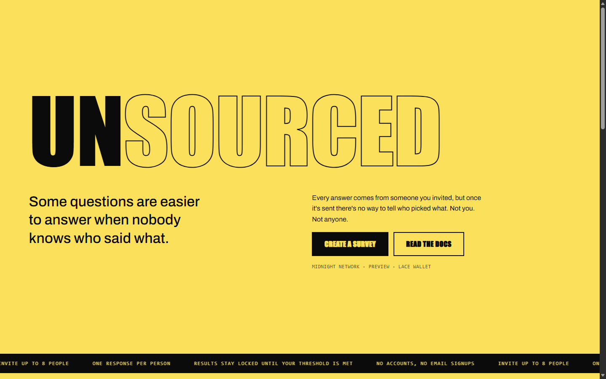
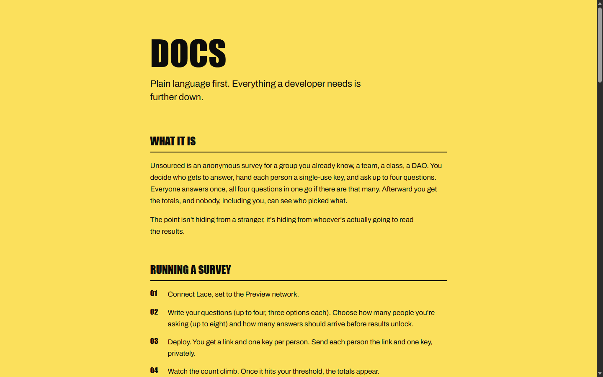

# Unsourced

[](https://github.com/IamHarrie-Labs/unsourced/actions/workflows/ci.yml)

> A survey where every response is provably from an eligible member, and nobody, including whoever ran it, can tell which one.

[@tryunsourced on X](https://x.com/tryunsourced)

## Live Demo

https://unsourced.xyz

Connect Lace (set to the Preview network) and click "Create survey" to start your own: no CLI, no setup file, just a form and a button. You'll get a shareable link and a set of one-time access keys, one per person you're asking. Send the link plus one key to each person; they open the link, paste their key, and answer each question. Try responding yourself with [this pre-made demo survey](https://unsourced.xyz/app?survey=9c4e3b4be9bd1b997f44bdbd5ba4af6df58c8e82a717a99102b5081e0c36841c&data=eyJxdWVzdGlvbnMiOlt7InRleHQiOiJIb3cncyB0aGlzIGN5Y2xlIGdvaW5nPyIsIm9wdGlvbnMiOlsiR29pbmcgd2VsbCIsIk1peGVkIiwiTmVlZHMgd29yayJdfV19) if you just want to see the respond side without creating one.

## Contract address

| Network | Address |
|---------|---------|
| Preview | 9c4e3b4be9bd1b997f44bdbd5ba4af6df58c8e82a717a99102b5081e0c36841c |

That's the address of the demo survey linked above; every survey created through the app gets its own fresh address the same way.

**A note on the network:** this runs on Preview, which is the network Midnight's own team pointed builders to while Preprod is mid-reset for mainnet prep. Same contract, same circuits, same frontend either way, only the network target differs.

## What this does

Anyone can start a survey: write up to four questions (three options each), say how many people you're asking (up to 8 for now), and how many answers should come in before you can see results. The app generates one access key per person and deploys a contract with only their key's hash written on-chain, never the key itself.

To answer, a person pastes the key they were given, then picks an option for each question. The app proves their key matches one of the hashes on that survey's roster, without ever saying which one, and sends every answer in a single transaction. That same hash doubles as a one-time-use marker: answer once, and the contract remembers, without remembering who you are.

No individual answer is ever stored on its own. Answering just adds one to a running tally for whichever option was picked on each question, so there's nothing on the ledger to unlink a person from an answer, because the two were never linked in the first place.

This is the build of the idea proposed in [PROPOSAL.md](PROPOSAL.md): an anonymous feedback tool for groups that already have a roster (teams, classes, DAOs) where the value isn't hiding from a stranger, it's hiding from the person who'll actually read the results.

## Privacy model

**What an on-chain observer can learn:**

- The 8 member commitments, published once at deploy time.
- The response count and the tally totals for every question.
- That some committed member responded, and which tallies grew, never which member.

**What an on-chain observer cannot learn:**

- Any member's secret key. It's a private witness, read only inside a proof generated on that member's own machine, never in the transaction, never in the ledger.
- Which of the 8 members submitted any given response.
- Whether two responses came from the same member or two different ones (impossible anyway: one response per member is enforced on-chain).

**What is proved without being revealed:** that the caller holds a key on this survey's roster, and that this key hasn't responded before. That's the entire access control and anti-double-voting mechanism, and neither ever puts a key on chain.

Results stay hidden in the frontend until the response count reaches a threshold set at deploy time (3, for the live demo). That's a display choice, not a cryptographic seal: the tallies are always on the public ledger, so anyone querying the indexer directly could read them early. The point of the threshold is that a handful of early answers can't be pinned on individuals by process of elimination, and it doesn't add a second layer of on-chain hiding beyond the anonymity that already exists between commitment and vote.

## Tech stack

Midnight network, Compact, Midnight.js SDK, React + Vite, Lace wallet, Node.js v22, Docker (for the local proof server).

## Prerequisites

- Node.js v22
- Docker Desktop, running
- The Compact toolchain (see setup below, on Windows this needs WSL2)
- The Lace wallet browser extension, with a Preview account

## Setup

```
git clone <your repo url>
cd unsourced
npm install
```

Compile the contract:

```
npm run compact
```

This generates `managed/survey` with the compiled circuits and keys.

Start the proof server in a separate terminal (leave it running):

```
docker run -p 6300:6300 midnightntwrk/proof-server:8.1.0 midnight-proof-server -v
```

## Run tests

```
npm test
```

Or with each test named:

```
npm run test:verbose
```

12 tests split into circuit logic / state transitions / privacy: a committed member can respond once, across every question in one submission; a non-member is rejected; a second response from the same member is rejected; tallies match the chosen options; question slots beyond a survey's real question count are ignored; no raw member key ever appears in ledger state.

## CI/CD

Every push and pull request to `main` runs [`.github/workflows/ci.yml`](.github/workflows/ci.yml), which checks out the repo, installs Node 22 and the Compact toolchain, compiles the contract from source, and runs the full test suite. The badge at the top of this README reflects the latest run.

## Run the frontend locally

```
npm run dev
```

Opens at `http://localhost:5173`. `VITE_NETWORK_ID` and `VITE_SURVEY_CONTRACT_ADDRESS` in `.env` control which network and contract the UI points at. Make sure Lace is unlocked and set to the matching network.

## Create a survey from the command line

The app itself is the normal way to create a survey; this is only for scripting or testing without a browser:

```
npm run deploy -- --network preview
```

Generates 8 fresh member keys, deploys with their commitments baked in, and writes the keys to a local `.survey-roster-keys.<network>.json` (gitignored, never commit it). Distribute one key per real member out of band, then delete the unused ones from your copy.

## Demo video

https://drive.google.com/file/d/1PdFnSlX4e8ZfXyfiCOi-aoBk6w07F-qF/view?usp=sharing

## Screenshots

The landing page:



The docs page:


